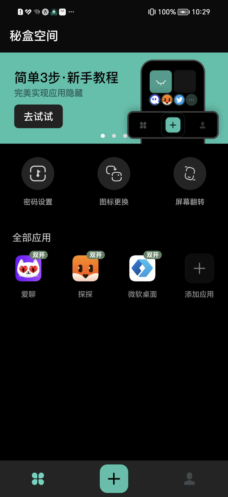
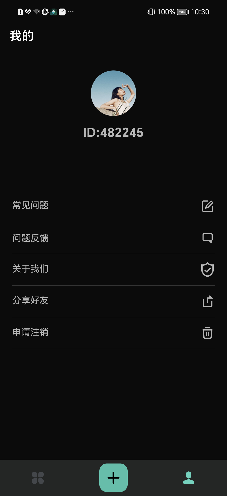
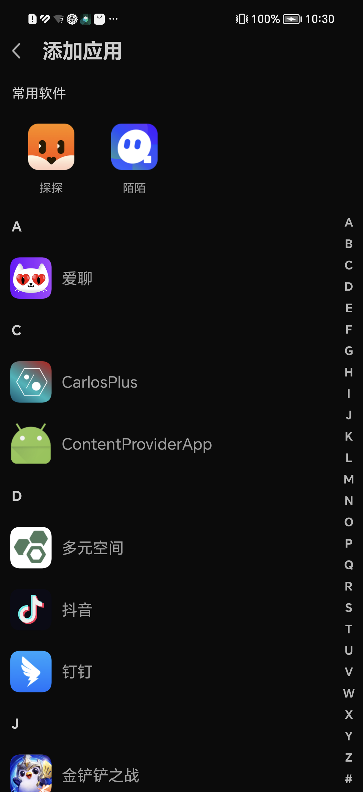

# 秘盒空间

|||
---|---|---|---

秘盒空间是一款应用隐私保护软件，可以将您的手机桌面已安装的各类应用都添加到秘盒空间内，避免TA人查看到您手机应用信息，打造个性化的隐私空间，再也不怕被人翻看手机，给您提供全方位的个人隐私安全保护！主要有应用隐藏，口保护
，翻转屏幕快速退出等功能呢

## 支持

目前已兼容 Android 9.0 ～ 15 , 其他系统版本可以使用，但不太稳定

## 交流群

Telegram[交流群跳转](https://t.me/mo_svc)

## 应用市场

1. 应用宝[下载地址](https://sj.qq.com/appdetail/com.hello.miheapp)
1. 华为市场[下载地址](https://appgallery.huawei.com/#/app/C108562001)
1. 小米市场[下载地址](https://app.mi.com/details?id=com.hello.miheapp&ref=search)
1. vivo市场[下载地址](http://info.appstore.vivo.com.cn/detail/3559272)


## 功能展示

||
---|---|---

本项目区分32位与64位，目前是2个不同的app，如在`添加应用`页面无法找到需要开启的app说明不支持，请编译其他的架构。

## 编译

### Step 1. 创建签名文件

### Step 2. 在app/local.properties填入一下信息

```
sign_storeFile=签名文件路径
sign_storePassword=密码
sign_keyAlias=别名
sign_keyPassword=密码
```

### Step 3. 执行命令 ./release_apk.sh

## 如何使用

### Step 1.初始化，在Application中加入以下代码初始化

```java
 @Override
protected void attachBaseContext(Context base){
    super.attachBaseContext(base);
    try{
    SandBoxCore.get()
    .doAttachBaseContext(
    base,
    new ClientConfiguration(){
@Override
public String getHostPackageName(){
    return base.getPackageName();
    }
    });
    }catch(Exception e){
    e.printStackTrace();
    }
    }

@Override
public void onCreate(){
    super.onCreate();
    SandBoxCore.get().doCreate();
    }
```

### Step 2.安装应用至秘盒空间内

```java
    // 已安装的应用可以提供包名
    SandBoxCore.get().installPackageAsUser("com.tencent.mm",userId);
        // 未安装的应用可以提供路径
        SandBoxCore.get().installPackageAsUser(new File("/sdcard/com.tencent.mm.apk"),userId);
```

### Step 2.运行秘盒空间内的应用

```java
   SandBoxCore.get().launchApk("com.tencent.mm",userId);
```

### 相关API

#### 获取秘盒空间内已安装的应用

```java
    // flgas与常规获取已安装应用保持一致即可
    SandBoxCore.get().getInstalledApplications(flags,userId);
        SandBoxCore.get().getInstalledPackages(flags,userId);
```

#### 获取秘盒空间内的User信息

```java
   List<BUserInfo> users=SandBoxCore.get().getUsers();
```

更多其他操作看SandBoxCore函数名大概就知道了。

#### Xposed相关

- 项目包含Xposed模块，但删除了功能入口
- Xposed已粗略过检测，[Xposed Checker](https://www.coolapk.com/apk/190247)
  、[XposedDetector](https://github.com/vvb2060/XposedDetector) 均无法检测

## 如何参与开发？

### 应用分2个模块

- app模块，用户操作与UI模块
- Bcore模块，此模块为秘盒空间的核心模块，负责完成整个应用的调度。

如需要参与开发请直接pr就可以了，相关教程请Google或者看 [如何在 GitHub 提交第一个 pull request](https://chinese.freecodecamp.org/news/how-to-make-your-first-pull-request-on-github/)

### PR须知

1. 中英文说明都可以，但是一定要详细说明问题
2. 请遵从原项目的代码风格、设计模式，请勿个性化。
3. PR不分大小，有问题随时欢迎提交。

## 计划

- 更多的Service API 虚拟化（目前许多是使用系统API，只有少数已实现）
- 提供更多接口给开发者（虚拟定位、应用注入等）

## 感谢

- [VirtualApp](https://github.com/asLody/VirtualApp/tree/fd29f19410caaf56060bc941a19299723b550970)
  （2017年10月29日版本，GPL3开源协议）
- [VirtualAPK](https://github.com/didi/VirtualAPK)
- [BlackReflection](https://github.com/CodingGay/BlackReflection)
- [FreeReflection](https://github.com/tiann/FreeReflection)
- [Pine](https://github.com/canyie/pine)

### License

[GPL3](LICENSE) 
# sandbox
